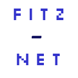

<!-- Improved compatibility of back to top link: See: https://github.com/othneildrew/Best-README-Template/pull/73 -->
<a name="readme-top"></a>


<!-- PROJECT SHIELDS -->
<!--
*** I'm using markdown "reference style" links for readability.
*** Reference links are enclosed in brackets [ ] instead of parentheses ( ).
*** See the bottom of this document for the declaration of the reference variables
*** for contributors-url, forks-url, etc. This is an optional, concise syntax you may use.
*** https://www.markdownguide.org/basic-syntax/#reference-style-links
-->
[![Contributors][contributors-shield]][contributors-url]
[![Forks][forks-shield]][forks-url]
[![Stargazers][stars-shield]][stars-url]
[![Issues][issues-shield]][issues-url]
[![MIT License][license-shield]][license-url]
[![LinkedIn][linkedin-shield]][linkedin-url]


<!-- PROJECT LOGO -->
<br />
<div align="center">
  <a href="https://github.com/mattlol85/Fitz-Net">
    
  </a>

<h3 align="center">Fitz-Net</h3>

  <p align="center">
    A collection of software to host @Mattlol85's ideas
    <br />
    <a href="https://github.com/mattlol85/Fitz-Net"><strong>Explore the docs »</strong></a>
    <br />
    <br />
    <a href="https://github.com/mattlol85/Fitz-Net">View Demo</a>
    ·
    <a href="https://github.com/mattlol85/Fitz-Net/issues">Report Bug</a>
    ·
    <a href="https://github.com/mattlol85/Fitz-Net/issues">Request Feature</a>
  </p>
</div>


<!-- TABLE OF CONTENTS -->
<details>
  <summary>Table of Contents</summary>
  <ol>
    <li>
      <a href="#about-the-project">About The Project</a>
      <ul>
        <li><a href="#built-with">Built With</a></li>
      </ul>
    </li>
    <li>
      <a href="#getting-started">Getting Started</a>
      <ul>
        <li><a href="#prerequisites">Prerequisites</a></li>
        <li><a href="#installation">Installation</a></li>
      </ul>
    </li>
    <li><a href="#usage">Usage</a></li>
    <li><a href="#roadmap">Roadmap</a></li>
    <li><a href="#contributing">Contributing</a></li>
    <li><a href="#license">License</a></li>
    <li><a href="#contact">Contact</a></li>
    <li><a href="#acknowledgments">Acknowledgments</a></li>
  </ol>
</details>


<!-- ABOUT THE PROJECT -->
## About The Project

[![Product Name Screen Shot][product-screenshot]](https://fitznet.org)

The Fitz-Net is a long standing idea of what I, [@mattlol85](https://github.com/mattlol85)  have always wanted and dreamed of. At the bare minimum, the Fitz-Net is a website that I can develop new ideas on, and have a physical place on the internet to access it from. Currently, there are two main components to the Fitz-Net, a React-based website, and a Spring API to go alongside it.

<p align="right">(<a href="#readme-top">back to top</a>)</p>


### Built With

* [![node][node]][node-url]
* [![React][React]][React-url]
* [![Spring][Spring]][Spring-url]
* [![Java][Java]][java-url]
* [![Jenkins][Jenkins]][Jenkins-url]


<p align="right">(<a href="#readme-top">back to top</a>)</p>


<!-- GETTING STARTED -->
## Getting Started

This is an example of how you may give instructions on setting up your project locally.
To get a local copy up and running follow these simple example steps.

### Prerequisites

This is an example of how to list things you need to use the software and how to install them. Keep in mind that parts of the project are intened to run on specific hardware.

### Unix:

* Update packages & Install JDK 17
  ```sh
  sudo apt update
  sudo apt install openjdk-17-jdk gradle git -y 
* Install Node Package Manager (npm)
  ```sh
  sudo apt install npm
  npm install npm@latest -g
  ```
### Windows:
*Info: Highly reccomend you use a WSL distro to work on this project.*
### Installation

1. Clone the repo and initialize and update submodules.
   ```sh
   git clone https://github.com/mattlol85/Fitz-Net.git
   cd Fitz-Net
   git submodule init
   git submodule update
   ```
2. Open Website Repo
   ```sh
   cd fitz-net-website
   ```
3. and or Fitz-Net API Repo
   ```sh
   cd fitz-net-api
   ```
   *Warning: If the directories are empty make sure you run the submodule init and update commands!*


<p align="right">(<a href="#readme-top">back to top</a>)</p>


<!-- USAGE EXAMPLES -->
## Usage

Use this space to show useful examples of how a project can be used. Additional screenshots, code examples and demos work well in this space. You may also link to more resources.

_For more examples, please refer to the [Documentation](https://example.com)_

<p align="right">(<a href="#readme-top">back to top</a>)</p>


<!-- ROADMAP -->
## Roadmap

- [ ] Complete a 1.0 release of Fitz-Net and its modules
- [ ] Create a hardware client that runs the API
- [ ] Design remote client that calls API. (A raspberry pi with buttons that connected to the API)
    - [ ] 3D Print, and upload files to Github

See the [open issues](https://github.com/mattlol85/Fitz-Net/issues) for a full list of proposed features (and known issues).

<p align="right">(<a href="#readme-top">back to top</a>)</p>


<!-- CONTRIBUTING -->
## Contributing

Contributions are what make the open source community such an amazing place to learn, inspire, and create. Any contributions you make to the Fitz-Net are **greatly appreciated**.

If you have a suggestion that would make this better, please fork the repo and create a pull request. You can also simply open an issue with the tag "enhancement".
Don't forget to give the project a star! Thanks again!

1. Fork the Project
2. Create your Feature Branch (`git checkout -b feature/AmazingFeature`)
3. Commit your Changes (`git commit -m 'Add some AmazingFeature'`)
4. Push to the Branch (`git push origin feature/AmazingFeature`)
5. Open a Pull Request

<p align="right">(<a href="#readme-top">back to top</a>)</p>


<!-- LICENSE -->
## License

Distributed under the MIT License. See `LICENSE.txt` for more information.

<p align="right">(<a href="#readme-top">back to top</a>)</p>


<!-- CONTACT -->
## Contact

Your Name - [@mattylol85](https://twitter.com/mattylol85) - mattlol85@gmail.com

Project Link: [https://github.com/mattlol85/Fitz-Net](https://github.com/mattlol85/Fitz-Net)

<p align="right">(<a href="#readme-top">back to top</a>)</p>


<!-- ACKNOWLEDGMENTS -->
## Acknowledgments

* [Me](https://github.com/mattlol85/Fitz-Net)
* [Myself](https://github.com/mattlol85/Fitz-Net)
* [I](https://github.com/mattlol85/Fitz-Net)

<p align="right">(<a href="#readme-top">back to top</a>)</p>


<!-- MARKDOWN LINKS & IMAGES -->
<!-- https://www.markdownguide.org/basic-syntax/#reference-style-links -->
[contributors-shield]: https://img.shields.io/github/contributors/mattlol85/Fitz-Net.svg?style=for-the-badge
[contributors-url]: https://github.com/mattlol85/Fitz-Net/graphs/contributors
[forks-shield]: https://img.shields.io/github/forks/mattlol85/Fitz-Net.svg?style=for-the-badge
[forks-url]: https://github.com/mattlol85/Fitz-Net/network/members
[stars-shield]: https://img.shields.io/github/stars/mattlol85/Fitz-Net.svg?style=for-the-badge
[stars-url]: https://github.com/mattlol85/Fitz-Net/stargazers
[issues-shield]: https://img.shields.io/github/issues/mattlol85/Fitz-Net.svg?style=for-the-badge
[issues-url]: https://github.com/mattlol85/Fitz-Net/issues
[license-shield]: https://img.shields.io/github/license/mattlol85/Fitz-Net.svg?style=for-the-badge
[license-url]: https://github.com/mattlol85/Fitz-Net/blob/master/LICENSE.txt
[linkedin-shield]: https://img.shields.io/badge/-LinkedIn-black.svg?style=for-the-badge&logo=linkedin&colorB=555
[linkedin-url]: https://linkedin.com/in/mattfitzbk


[product-screenshot]: images/screenshot.png


[node]: https://img.shields.io/badge/Node.js-339933?style=for-the-badge&logo=node.js&logoColor=white
[node-url]: https://nodejs.org/

[javascript]: https://img.shields.io/badge/JavaScript-F7DF1E?style=for-the-badge&logo=javascript&logoColor=black
[javascript-url]: https://developer.mozilla.org/en-US/docs/Web/JavaScript

[java]: https://img.shields.io/badge/Java-FFA500?style=for-the-badge&logo=opendjk&logoColor=white
[java-url]: https://www.java.com/

[spring]: https://img.shields.io/badge/Spring-6DB33F?style=for-the-badge&logo=spring&logoColor=white
[spring-url]: https://spring.io/

[jenkins]: https://img.shields.io/badge/Jenkins-D24939?style=for-the-badge&logo=Jenkins&logoColor=white
[jenkins-url]: https://jenkins.io/

[react]: https://img.shields.io/badge/React-61DAFB?style=for-the-badge&logo=react&logoColor=black
[react-url]: https://reactjs.org/
