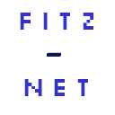
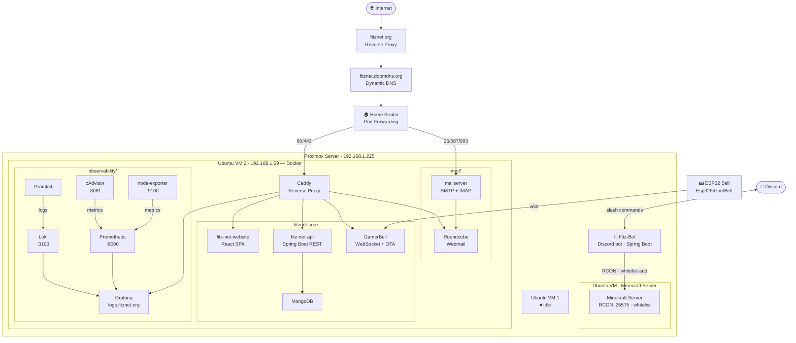
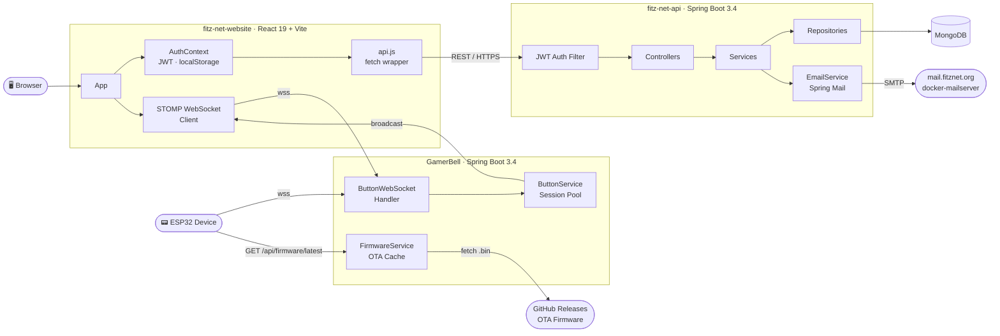

<!-- Improved compatibility of back to top link: See: https://github.com/othneildrew/Best-README-Template/pull/73 -->
<a name="readme-top"></a>

<!-- PROJECT SHIELDS -->
[![Contributors][contributors-shield]][contributors-url]
[![Forks][forks-shield]][forks-url]
[![Stargazers][stars-shield]][stars-url]
[![Issues][issues-shield]][issues-url]
[![MIT License][license-shield]][license-url]
[![LinkedIn][linkedin-shield]][linkedin-url]


<!-- PROJECT LOGO -->
<br />
<div align="center">
  <a href="https://github.com/mattlol85/Fitz-Net">
    
  </a>

<h3 align="center">Fitz-Net</h3>

  <p align="center">
    A self-hosted platform for @mattlol85's ideas — running on bare metal, served to the internet.
    <br />
    <a href="https://github.com/mattlol85/Fitz-Net"><strong>Explore the docs »</strong></a>
    <br />
    <br />
    <a href="https://fitznet.org">Live Site</a>
    ·
    <a href="https://github.com/mattlol85/Fitz-Net/issues">Report Bug</a>
    ·
    <a href="https://github.com/mattlol85/Fitz-Net/issues">Request Feature</a>
  </p>
</div>


<!-- TABLE OF CONTENTS -->
<details>
  <summary>Table of Contents</summary>
  <ol>
    <li><a href="#about-the-project">About The Project</a></li>
    <li><a href="#architecture">Architecture</a>
      <ul>
        <li><a href="#infrastructure">Infrastructure</a></li>
        <li><a href="#services">Services</a></li>
      </ul>
    </li>
    <li><a href="#repositories">Repositories</a></li>
    <li>
      <a href="#service-details">Service Details</a>
      <ul>
        <li><a href="#fitz-net-website">fitz-net-website</a></li>
        <li><a href="#fitz-net-api">fitz-net-api</a></li>
        <li><a href="#gamerbell">GamerBell</a></li>
        <li><a href="#esp32fitznetbell">Esp32FitznetBell</a></li>
        <li><a href="#fitz-bot">Fitz-Bot</a></li>
        <li><a href="#mail-server">Mail Server</a></li>
      </ul>
    </li>
    <li><a href="#built-with">Built With</a></li>
    <li><a href="#getting-started">Getting Started</a></li>
    <li><a href="#roadmap">Roadmap</a></li>
    <li><a href="#contributing">Contributing</a></li>
    <li><a href="#license">License</a></li>
    <li><a href="#contact">Contact</a></li>
  </ol>
</details>


<!-- ABOUT THE PROJECT -->
## About The Project

[![Product Name Screen Shot][product-screenshot]](https://fitznet.org)

Fitz-Net is a self-hosted, full-stack personal platform running on a home server — exposed to the internet via dynamic DNS. It's a place to build and ship real ideas, backed by real infrastructure: a Proxmox hypervisor, Docker containers, a Caddy reverse proxy, physical ESP32 hardware that talks to the backend over WebSockets, a self-hosted email server for `fitznet.org`, a Discord bot (**Fitz-Bot**) that manages a Minecraft server, and a full observability stack (Grafana, Loki, Prometheus, Promtail, cAdvisor).

<p align="right">(<a href="#readme-top">back to top</a>)</p>


<!-- ARCHITECTURE -->
## Architecture

### Infrastructure

Traffic arrives at `fitznet.org`, which is fronted by an external reverse proxy that forwards to `fitznet.doomdns.org` (dynamic DNS on the home router). From there it reaches a Proxmox server where the active Ubuntu VM runs Docker, hosting all services behind a Caddy reverse proxy. A second Ubuntu VM is kept idle as a spare/staging target.


```mermaid
graph TD
    Internet(["🌐 Internet"])
    FitznetOrg["fitznet.org\nReverse Proxy"]
    DNS["fitznet.doomdns.org\nDynamic DNS"]
    Router["🏠 Home Router\nPort Forwarding"]

    subgraph Proxmox["Proxmox Server · 192.168.1.225"]
        VM1["Ubuntu VM 1\n⏸ Idle"]

        subgraph VM2["Ubuntu VM 2 · 192.168.1.59 — Docker"]
            Caddy["Caddy\nReverse Proxy"]

            subgraph Core["fitznet-core"]
                Website["fitz-net-website\nReact SPA"]
                API["fitz-net-api\nSpring Boot REST"]
                Bell["GamerBell\nWebSocket + OTA"]
                Mongo["MongoDB"]
            end

            subgraph Mail["mail/"]
                MailServer["mailserver\nSMTP + IMAP"]
                Roundcube["Roundcube\nWebmail"]
            end

            subgraph Obs["observability/"]
                Grafana["Grafana\nlogs.fitznet.org"]
                Prometheus["Prometheus\n:9090"]
                Loki["Loki\n:3100"]
                Promtail["Promtail"]
                CAdvisor["cAdvisor\n:8081"]
                NodeExp["node-exporter\n:9100"]
            end
        end

        FitzBot["🤖 Fitz-Bot\nDiscord bot · Spring Boot"]

        subgraph VM3["Ubuntu VM · Minecraft Server"]
            MC["Minecraft Server\nRCON :25575 · whitelist"]
        end
    end

    ESP32["📟 ESP32 Bell\nEsp32FitznetBell"]
    Discord(["💬 Discord"])

    Internet --> FitznetOrg --> DNS --> Router
    Router -->|"80/443"| Caddy
    Router -->|"25/587/993"| MailServer
    Caddy --> Website
    Caddy --> API
    Caddy --> Bell
    Caddy --> Roundcube
    Caddy --> Grafana
    API --> Mongo
    MailServer --> Roundcube
    ESP32 -->|"wss"| Bell
    Discord <-->|"slash commands"| FitzBot
    FitzBot -->|"RCON · whitelist add"| MC

    Promtail -->|"logs"| Loki
    CAdvisor -->|"metrics"| Prometheus
    NodeExp -->|"metrics"| Prometheus
    Loki --> Grafana
    Prometheus --> Grafana
```

### Services

The services and how they interact at the application layer:


```mermaid
graph LR
    Browser(["🖥 Browser"])
    ESP32(["📟 ESP32 Device"])

    subgraph Website["fitz-net-website · React 19 + Vite"]
        React["App"]
        AuthCtx["AuthContext\nJWT · localStorage"]
        ApiSvc["api.js\nfetch wrapper"]
        WSClient["STOMP WebSocket\nClient"]
    end

    subgraph API["fitz-net-api · Spring Boot 3.4"]
        SecFilter["JWT Auth Filter"]
        Controllers["Controllers"]
        Services["Services"]
        Repos["Repositories"]
        MailSvc["EmailService\nSpring Mail"]
    end

    subgraph Bell["GamerBell · Spring Boot 3.4"]
        WSHandler["ButtonWebSocket\nHandler"]
        BellSvc["ButtonService\nSession Pool"]
        FirmSvc["FirmwareService\nOTA Cache"]
    end

    Mongo[("MongoDB")]
    GitHub(["GitHub Releases\nOTA Firmware"])
    MailServer(["mail.fitznet.org\ndocker-mailserver"])

    Browser --> React
    React --> AuthCtx --> ApiSvc
    ApiSvc -->|"REST / HTTPS"| SecFilter
    SecFilter --> Controllers --> Services --> Repos --> Mongo
    Services --> MailSvc -->|"SMTP"| MailServer

    React --> WSClient
    WSClient -->|"wss"| WSHandler
    WSHandler --> BellSvc -->|"broadcast"| WSClient

    ESP32 -->|"wss"| WSHandler
    ESP32 -->|"GET /api/firmware/latest"| FirmSvc
    FirmSvc -->|"fetch .bin"| GitHub
```

<p align="right">(<a href="#readme-top">back to top</a>)</p>


<!-- REPOSITORIES -->
## Repositories

| Repo | Description |
|---|---|
| [Fitz-Net](https://github.com/mattlol85/Fitz-Net) | This repo — orchestration hub, architecture docs |
| [fitz-net-api](https://github.com/mattlol85/fitz-net-api) | Spring Boot 3.4 REST API — user management, auth, encryption, email |
| [fitz-net-website](https://github.com/mattlol85/fitz-net-website) | React 19 SPA — dashboard, live board, game stats, auth, password reset |
| [GamerBell](https://github.com/mattlol85/GamerBell) | Spring Boot WebSocket relay + OTA firmware server for ESP32 bells |
| [Esp32FitznetBell](https://github.com/mattlol85/Esp32FitznetBell) | C++ / PlatformIO firmware for the physical ESP32 bell button |
| [Fitz-Bot](https://github.com/mattlol85/Fitz-Bot) | Discord bot — voice-join milestones, media downloads (Radarr/Sonarr), Minecraft whitelist management |
| [Fitz-Net-Agent-Sandbox](https://github.com/mattlol85/Fitz-Net-Agent-Sandbox) | AI agent workspace + mail server Docker Compose config |

<p align="right">(<a href="#readme-top">back to top</a>)</p>


<!-- SERVICE DETAILS -->
## Service Details

### fitz-net-website

**Repo:** [mattlol85/fitz-net-website](https://github.com/mattlol85/fitz-net-website)  
**Live:** https://fitznet.org

React 19 frontend served via Caddy. Features:
- Homepage with animated Fitz-Net branding
- Overwatch 2 tracker — competitive leaderboard, history charts, player avatars
- LiveBoard — real-time collaborative canvas via STOMP WebSocket
- GamerBell widget — live status of physical ESP32 button devices
- Status Dashboard — monitors all service health via Spring Actuator
- User auth (JWT), profile editing, **forgot-password / reset-password flow**

**Stack:** React 19 · Vite 6 · React Router 7 · Vanilla CSS Modules · Docker

---

### fitz-net-api

**Repo:** [mattlol85/fitz-net-api](https://github.com/mattlol85/fitz-net-api)  
**Live:** https://api.fitznet.org

Spring Boot 3.4 REST API and WebSocket backend. Features:
- User management (register, login, JWT auth, profile update)
- Overwatch 2 integration via OverFast API (player stats, ratings, history snapshots)
- LiveBoard STOMP WebSocket for shared canvas state
- AES encryption endpoints
- **Password reset via email** — generates secure tokens, sends reset links via `noreply@fitznet.org`

**Stack:** Java 21 · Spring Boot 3.4 · MongoDB · Spring Security (JWT/BCrypt) · Spring Mail · Gradle · Docker

**Key environment variables:**

| Variable | Purpose |
|---|---|
| `JWT_SECRET` | HS256 signing key |
| `MONGO_HOST` / `MONGO_PORT` | MongoDB connection |
| `MAIL_HOST` | SMTP host (`mail.fitznet.org`) |
| `MAIL_USERNAME` | SMTP user (`noreply@fitznet.org`) |
| `MAIL_PASSWORD` | SMTP password |
| `APP_BASE_URL` | Base URL for reset links (`https://fitznet.org`) |

---

### GamerBell

**Repo:** [mattlol85/GamerBell](https://github.com/mattlol85/GamerBell)  
**Live:** https://gamerbell.fitznet.org

Spring Boot WebSocket relay service bridging physical ESP32 button devices with the Fitz-Net web UI. Also handles over-the-air (OTA) firmware updates for ESP32s via the GitHub Releases API.

**Stack:** Java 21 · Spring Boot 3.4 · Spring WebSocket · Docker

---

### Esp32FitznetBell

**Repo:** [mattlol85/Esp32FitznetBell](https://github.com/mattlol85/Esp32FitznetBell)

C++ / PlatformIO firmware for the physical ESP32 bell button. The device connects to **GamerBell** over a WebSocket to broadcast button press/release events and shows the currently active users on a local 0.96" OLED screen. WiFi credentials and the user's display name are configured at first boot through the `FitzNetBell-Setup` WiFiManager captive portal — nothing is hardcoded. New firmware is published as GitHub Releases and pushed to devices over the air via GamerBell's `GET /api/firmware/latest`.

**Hardware:** ESP32 DevKit · SSD1306 OLED (I2C — SDA GPIO 21, SCL GPIO 22) · push button on GPIO 13.

**Stack:** C++ · PlatformIO · Arduino framework · WebSockets · Adafruit SSD1306/GFX · ArduinoJson · WiFiManager · FastLED

---

### Fitz-Bot

**Repo:** [mattlol85/Fitz-Bot](https://github.com/mattlol85/Fitz-Bot)

Discord bot for the Fitz-Net community. Built on JDA, it tracks voice-channel activity and posts milestone celebrations, exposes media-download commands backed by Radarr/Sonarr, and manages the **Minecraft server** that runs on a separate VM adjacent to the Docker host.

The `/whitelist <username>` command lets trusted members (gated by a configurable Discord role) add players to the Minecraft whitelist over **RCON**. Together with `white-list=true` + `online-mode=true` on the server, this keeps anonymous crawlers/bots out.

**Slash commands:**

| Command | Purpose |
|---|---|
| `/whitelist <username>` | Add a player to the Minecraft whitelist (role-gated) |
| `/setwhitelistrole <role>` | Choose which Discord role may use `/whitelist` (admin) |
| `/setbotchannel` · `/getbotchannel` | Configure where milestone messages post |
| `/joenet download` · `/joenet status` | Search/queue movies & TV (Radarr/Sonarr) |

**Stack:** Java 21 · Spring Boot 3.2 · JDA 5 · Gradle

**Key environment variables:**

| Variable | Purpose |
|---|---|
| `DISCORD_BOT_TOKEN` | Discord bot token |
| `MINECRAFT_RCON_HOST` / `MINECRAFT_RCON_PORT` | Minecraft server RCON endpoint |
| `MINECRAFT_RCON_PASSWORD` | RCON password (matches `rcon.password` in `server.properties`) |
| `JOENET_HOST` · `JOENET_RADARR_APIKEY` · `JOENET_SONARR_APIKEY` | Media download integration |

See [`docs/fitz-bot.md`](docs/fitz-bot.md) for the Minecraft topology and whitelist/RCON setup guide.

---

### Mail Server

**Config:** [`Fitz-Net-Agent-Sandbox/mail/`](https://github.com/mattlol85/Fitz-Net-Agent-Sandbox)  
**Live:** https://mail.fitznet.org (webmail) · `mail.fitznet.org:993` (IMAP) · `mail.fitznet.org:587` (SMTP)

Self-hosted email for `fitznet.org` running via Docker Compose alongside the other services.

| Container | Image | Role |
|---|---|---|
| `mailserver` | `ghcr.io/docker-mailserver/docker-mailserver` | SMTP (Postfix) + IMAP (Dovecot) + rspamd spam filter + DKIM |
| `roundcube` | `roundcube/roundcubemail` | Browser-based webmail, proxied through Caddy |

**DNS records required:**

| Type | Name | Value |
|---|---|---|
| A | `mail` | `<public IP>` |
| MX | `@` | `mail.fitznet.org` (priority 10) |
| TXT | `@` | `v=spf1 mx ~all` |
| TXT | `_dmarc` | `v=DMARC1; p=none; rua=mailto:admin@fitznet.org` |
| TXT | `dkim._domainkey` | *(generated by docker-mailserver)* |

See [`docs/mail-server.md`](docs/mail-server.md) for the full step-by-step setup guide.

<p align="right">(<a href="#readme-top">back to top</a>)</p>


<!-- BUILT WITH -->
## Built With

* [![React][React]][React-url]
* [![Spring][Spring]][Spring-url]
* [![Java][Java]][java-url]
* [![Node][node]][node-url]
* [![MongoDB][MongoDB]][MongoDB-url]
* [![Docker][Docker]][Docker-url]
* [![Caddy][Caddy]][Caddy-url]
* [![Grafana][Grafana]][Grafana-url]

<p align="right">(<a href="#readme-top">back to top</a>)</p>


<!-- GETTING STARTED -->
## Getting Started

Each component lives in its own repository. Clone the ones you need:

```sh
git clone https://github.com/mattlol85/fitz-net-api.git
git clone https://github.com/mattlol85/fitz-net-website.git
git clone https://github.com/mattlol85/GamerBell.git
git clone https://github.com/mattlol85/Esp32FitznetBell.git
```

**fitz-net-api** — requires Java 21 and MongoDB:
```sh
cd fitz-net-api
./gradlew bootRun
```

**fitz-net-website** — requires Node.js:
```sh
cd fitz-net-website
npm install
npm run dev
```

**GamerBell** — requires Java 21:
```sh
cd GamerBell
./gradlew bootRun --args='--spring.profiles.active=dev'
```

**Esp32FitznetBell** — requires [PlatformIO](https://platformio.org/) and an ESP32 board:
```sh
cd Esp32FitznetBell
pio run                 # Compile firmware
pio run --target upload  # Flash to a connected ESP32 over USB
pio device monitor       # Serial logs (115200 baud)
# First boot: connect to the "FitzNetBell-Setup" WiFi AP to set WiFi + display name
```

**Mail stack** — run on the Proxmox Docker host:
```sh
cd Fitz-Net-Agent-Sandbox/mail
docker compose up -d
# First time: create mailboxes and generate DKIM
docker exec -ti mailserver setup email add matt@fitznet.org
docker exec -ti mailserver setup email add noreply@fitznet.org
docker exec -ti mailserver setup config dkim
```

**Observability stack** — run on the Docker host:
```sh
cd observability
docker compose up -d
# Grafana UI available at https://logs.fitznet.org (default login: admin / admin)
```

See each repo's `.github/agents.md` for full conventions, build commands, and architecture details.  
See [`docs/mail-server.md`](docs/mail-server.md) for the complete mail server setup guide.

<p align="right">(<a href="#readme-top">back to top</a>)</p>


<!-- ROADMAP -->
## Roadmap

- [x] React frontend + Spring Boot API
- [x] JWT authentication and user management
- [x] Overwatch 2 stats tracker and leaderboard
- [x] LiveBoard — real-time collaborative canvas
- [x] ESP32 physical bell button with WebSocket integration (GamerBell + Esp32FitznetBell)
- [x] OTA firmware updates for ESP32 devices via GitHub Releases
- [x] Self-hosted on Proxmox + Docker behind Caddy reverse proxy
- [x] Observability stack — Grafana, Loki, Prometheus, Promtail, cAdvisor, node-exporter
- [x] Self-hosted email at fitznet.org (docker-mailserver + Roundcube)
- [x] Password reset via email
- [ ] Raspberry Pi remote client with hardware buttons
    - [ ] 3D print enclosure and upload files to GitHub
- [ ] Complete a 1.0 release

See the [open issues](https://github.com/mattlol85/Fitz-Net/issues) for a full list of proposed features and known issues.

<p align="right">(<a href="#readme-top">back to top</a>)</p>


<!-- CONTRIBUTING -->
## Contributing

1. Fork the relevant repo
2. Create a feature branch: `git checkout -b feature/your-feature`
3. Commit using conventional commits:
   ```
   feat(scope): what you added
   fix(scope): what you fixed
   chore(scope): maintenance change
   ```
4. Push and open a Pull Request against `main`

<p align="right">(<a href="#readme-top">back to top</a>)</p>


<!-- LICENSE -->
## License

Distributed under the MIT License. See `LICENSE` for more information.

<p align="right">(<a href="#readme-top">back to top</a>)</p>


## Contact

Matt - [@mattylol85](https://twitter.com/mattylol85) - mattlol85@gmail.com

Project Link: [https://github.com/mattlol85/Fitz-Net](https://github.com/mattlol85/Fitz-Net)

<p align="right">(<a href="#readme-top">back to top</a>)</p>


<!-- MARKDOWN LINKS & IMAGES -->
[contributors-shield]: https://img.shields.io/github/contributors/mattlol85/Fitz-Net.svg?style=for-the-badge
[contributors-url]: https://github.com/mattlol85/Fitz-Net/graphs/contributors
[forks-shield]: https://img.shields.io/github/forks/mattlol85/Fitz-Net.svg?style=for-the-badge
[forks-url]: https://github.com/mattlol85/Fitz-Net/network/members
[stars-shield]: https://img.shields.io/github/stars/mattlol85/Fitz-Net.svg?style=for-the-badge
[stars-url]: https://github.com/mattlol85/Fitz-Net/stargazers
[issues-shield]: https://img.shields.io/github/issues/mattlol85/Fitz-Net.svg?style=for-the-badge
[issues-url]: https://github.com/mattlol85/Fitz-Net/issues
[license-shield]: https://img.shields.io/github/license/mattlol85/Fitz-Net.svg?style=for-the-badge
[license-url]: https://github.com/mattlol85/Fitz-Net/blob/master/LICENSE.txt
[linkedin-shield]: https://img.shields.io/badge/-LinkedIn-black.svg?style=for-the-badge&logo=linkedin&colorB=555
[linkedin-url]: https://linkedin.com/in/mattfitzbk

[product-screenshot]: images/screenshot.png

[node]: https://img.shields.io/badge/Node.js-339933?style=for-the-badge&logo=node.js&logoColor=white
[node-url]: https://nodejs.org/

[java]: https://img.shields.io/badge/Java-FFA500?style=for-the-badge&logo=openjdk&logoColor=white
[java-url]: https://www.java.com/

[spring]: https://img.shields.io/badge/Spring-6DB33F?style=for-the-badge&logo=spring&logoColor=white
[spring-url]: https://spring.io/

[React]: https://img.shields.io/badge/React-61DAFB?style=for-the-badge&logo=react&logoColor=black
[React-url]: https://reactjs.org/

[MongoDB]: https://img.shields.io/badge/MongoDB-47A248?style=for-the-badge&logo=mongodb&logoColor=white
[MongoDB-url]: https://www.mongodb.com/

[Docker]: https://img.shields.io/badge/Docker-2496ED?style=for-the-badge&logo=docker&logoColor=white
[Docker-url]: https://www.docker.com/

[Caddy]: https://img.shields.io/badge/Caddy-1F88C0?style=for-the-badge&logo=caddy&logoColor=white
[Caddy-url]: https://caddyserver.com/

[Grafana]: https://img.shields.io/badge/Grafana-F46800?style=for-the-badge&logo=grafana&logoColor=white
[Grafana-url]: https://grafana.com/
