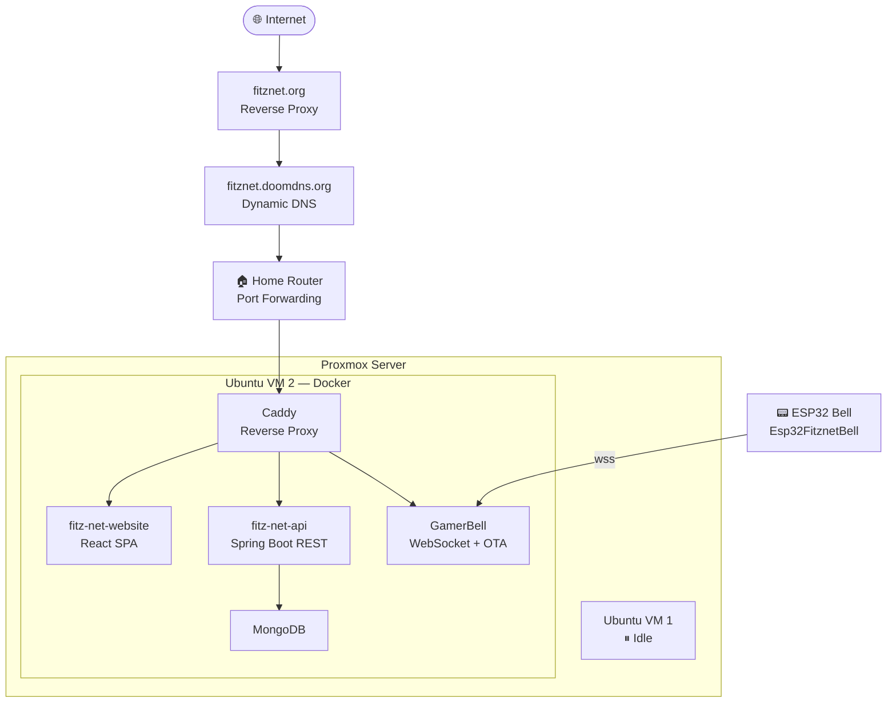
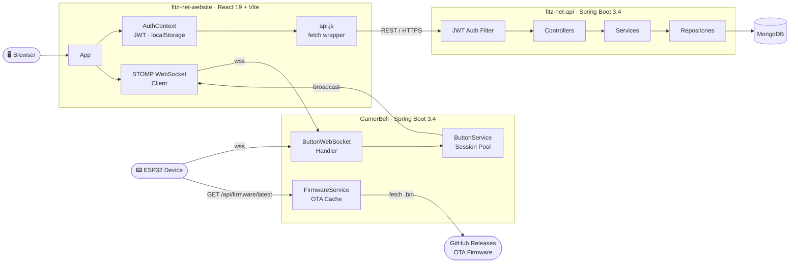

<!-- Improved compatibility of back to top link: See: https://github.com/othneildrew/Best-README-Template/pull/73 -->
<a name="readme-top"></a>


<!-- PROJECT SHIELDS -->
[![Contributors][contributors-shield]][contributors-url]
[![Forks][forks-shield]][forks-url]
[![Stargazers][stars-shield]][stars-url]
[![Issues][issues-shield]][issues-url]
[![MIT License][license-shield]][license-url]
[![LinkedIn][linkedin-shield]][linkedin-url]


<!-- PROJECT LOGO -->
<br />
<div align="center">
  <a href="https://github.com/mattlol85/Fitz-Net">
    
  </a>

<h3 align="center">Fitz-Net</h3>

  <p align="center">
    A self-hosted platform for @mattlol85's ideas — running on bare metal, served to the internet.
    <br />
    <a href="https://github.com/mattlol85/Fitz-Net"><strong>Explore the docs »</strong></a>
    <br />
    <br />
    <a href="https://fitznet.org">Live Site</a>
    ·
    <a href="https://github.com/mattlol85/Fitz-Net/issues">Report Bug</a>
    ·
    <a href="https://github.com/mattlol85/Fitz-Net/issues">Request Feature</a>
  </p>
</div>


<!-- TABLE OF CONTENTS -->
<details>
  <summary>Table of Contents</summary>
  <ol>
    <li><a href="#about-the-project">About The Project</a></li>
    <li><a href="#architecture">Architecture</a>
      <ul>
        <li><a href="#infrastructure">Infrastructure</a></li>
        <li><a href="#services">Services</a></li>
      </ul>
    </li>
    <li><a href="#repositories">Repositories</a></li>
    <li><a href="#built-with">Built With</a></li>
    <li><a href="#getting-started">Getting Started</a></li>
    <li><a href="#roadmap">Roadmap</a></li>
    <li><a href="#contributing">Contributing</a></li>
    <li><a href="#license">License</a></li>
    <li><a href="#contact">Contact</a></li>
  </ol>
</details>


<!-- ABOUT THE PROJECT -->
## About The Project

[![Product Name Screen Shot][product-screenshot]](https://fitznet.org)

Fitz-Net is a self-hosted, full-stack personal platform running on a home server — exposed to the internet via dynamic DNS. It's a place to build and ship real ideas, backed by real infrastructure: a Proxmox hypervisor, Docker containers, a reverse proxy, and physical ESP32 hardware that talks to the backend over WebSockets.

<p align="right">(<a href="#readme-top">back to top</a>)</p>


<!-- ARCHITECTURE -->
## Architecture

### Infrastructure

Traffic arrives at `fitznet.org`, which is fronted by an external reverse proxy that forwards to `fitznet.doomdns.org` (dynamic DNS on the home router). From there it reaches a Proxmox server where the active Ubuntu VM runs Docker, hosting all services behind a Caddy reverse proxy. A second Ubuntu VM is kept idle as a spare/staging target.


```mermaid
graph TD
    Internet(["🌐 Internet"])
    FitznetOrg["fitznet.org\nReverse Proxy"]
    DNS["fitznet.doomdns.org\nDynamic DNS"]
    Router["🏠 Home Router\nPort Forwarding"]

    subgraph Proxmox["Proxmox Server"]
        VM1["Ubuntu VM 1\n⏸ Idle"]

        subgraph VM2["Ubuntu VM 2 — Docker"]
            Caddy["Caddy\nReverse Proxy"]
            Website["fitz-net-website\nReact SPA"]
            API["fitz-net-api\nSpring Boot REST"]
            Bell["GamerBell\nWebSocket + OTA"]
            Mongo["MongoDB"]
        end
    end

    ESP32["📟 ESP32 Bell\nEsp32FitznetBell"]

    Internet --> FitznetOrg --> DNS --> Router --> Caddy
    Caddy --> Website
    Caddy --> API
    Caddy --> Bell
    API --> Mongo
    ESP32 -->|"wss"| Bell
```

### Services

The four services and how they interact at the application layer:


```mermaid
graph LR
    Browser(["🖥 Browser"])
    ESP32(["📟 ESP32 Device"])

    subgraph Website["fitz-net-website · React 19 + Vite"]
        React["App"]
        AuthCtx["AuthContext\nJWT · localStorage"]
        ApiSvc["api.js\nfetch wrapper"]
        WSClient["STOMP WebSocket\nClient"]
    end

    subgraph API["fitz-net-api · Spring Boot 3.4"]
        SecFilter["JWT Auth Filter"]
        Controllers["Controllers"]
        Services["Services"]
        Repos["Repositories"]
    end

    subgraph Bell["GamerBell · Spring Boot 3.4"]
        WSHandler["ButtonWebSocket\nHandler"]
        BellSvc["ButtonService\nSession Pool"]
        FirmSvc["FirmwareService\nOTA Cache"]
    end

    Mongo[("MongoDB")]
    GitHub(["GitHub Releases\nOTA Firmware"])

    Browser --> React
    React --> AuthCtx --> ApiSvc
    ApiSvc -->|"REST / HTTPS"| SecFilter
    SecFilter --> Controllers --> Services --> Repos --> Mongo

    React --> WSClient
    WSClient -->|"wss"| WSHandler
    WSHandler --> BellSvc -->|"broadcast"| WSClient

    ESP32 -->|"wss"| WSHandler
    ESP32 -->|"GET /api/firmware/latest"| FirmSvc
    FirmSvc -->|"fetch .bin"| GitHub
```

<p align="right">(<a href="#readme-top">back to top</a>)</p>


<!-- REPOSITORIES -->
## Repositories

| Repo | Description |
|---|---|
| [Fitz-Net](https://github.com/mattlol85/Fitz-Net) | This repo — orchestration hub, GitHub Actions, shared agent docs |
| [fitz-net-api](https://github.com/mattlol85/fitz-net-api) | Spring Boot 3.4 REST API — user management, auth, encryption |
| [fitz-net-website](https://github.com/mattlol85/fitz-net-website) | React 19 SPA — dashboard, live board, game stats, auth |
| [GamerBell](https://github.com/mattlol85/GamerBell) | Spring Boot WebSocket relay + OTA firmware server for ESP32 bells |
| [Esp32FitznetBell](https://github.com/mattlol85/Esp32FitznetBell) | C++ / PlatformIO firmware for the physical ESP32 bell button |

<p align="right">(<a href="#readme-top">back to top</a>)</p>


<!-- BUILT WITH -->
## Built With

* [![React][React]][React-url]
* [![Spring][Spring]][Spring-url]
* [![Java][Java]][java-url]
* [![Node][node]][node-url]
* [![MongoDB][MongoDB]][MongoDB-url]
* [![Docker][Docker]][Docker-url]
* [![Caddy][Caddy]][Caddy-url]

<p align="right">(<a href="#readme-top">back to top</a>)</p>


<!-- GETTING STARTED -->
## Getting Started

Each component lives in its own repository. Clone the ones you need:

```sh
git clone https://github.com/mattlol85/fitz-net-api.git
git clone https://github.com/mattlol85/fitz-net-website.git
git clone https://github.com/mattlol85/GamerBell.git
git clone https://github.com/mattlol85/Esp32FitznetBell.git
```

**fitz-net-api** — requires Java 21 and MongoDB:
```sh
cd fitz-net-api
./gradlew bootRun
```

**fitz-net-website** — requires Node.js:
```sh
cd fitz-net-website
npm install
npm run dev
```

**GamerBell** — requires Java 21:
```sh
cd GamerBell
./gradlew bootRun --args='--spring.profiles.active=dev'
```

See each repo's `.github/agents.md` for full conventions, build commands, and architecture details.

<p align="right">(<a href="#readme-top">back to top</a>)</p>


<!-- ROADMAP -->
## Roadmap

- [x] React frontend + Spring Boot API (v1.0)
- [x] JWT authentication and user management
- [x] ESP32 physical bell button with WebSocket integration (GamerBell + Esp32FitznetBell)
- [x] OTA firmware updates for ESP32 devices via GitHub Releases
- [x] Self-hosted on Proxmox + Docker behind Caddy reverse proxy
- [ ] Raspberry Pi remote client with hardware buttons
    - [ ] 3D print enclosure and upload files to GitHub

See the [open issues](https://github.com/mattlol85/Fitz-Net/issues) for a full list of proposed features and known issues.

<p align="right">(<a href="#readme-top">back to top</a>)</p>


<!-- CONTRIBUTING -->
## Contributing

1. Fork the relevant repo
2. Create a feature branch: `git checkout -b feature/your-feature`
3. Commit using conventional commits:
   ```
   feat(scope): what you added
   fix(scope): what you fixed
   chore(scope): maintenance change
   ```
4. Push and open a Pull Request against `main`

<p align="right">(<a href="#readme-top">back to top</a>)</p>


<!-- LICENSE -->
## License

Distributed under the MIT License. See `LICENSE` for more information.

<p align="right">(<a href="#readme-top">back to top</a>)</p>


<!-- CONTACT -->
## Contact

Matt - [@mattylol85](https://twitter.com/mattylol85) - mattlol85@gmail.com

Project Link: [https://github.com/mattlol85/Fitz-Net](https://github.com/mattlol85/Fitz-Net)

<p align="right">(<a href="#readme-top">back to top</a>)</p>


<!-- MARKDOWN LINKS & IMAGES -->
[contributors-shield]: https://img.shields.io/github/contributors/mattlol85/Fitz-Net.svg?style=for-the-badge
[contributors-url]: https://github.com/mattlol85/Fitz-Net/graphs/contributors
[forks-shield]: https://img.shields.io/github/forks/mattlol85/Fitz-Net.svg?style=for-the-badge
[forks-url]: https://github.com/mattlol85/Fitz-Net/network/members
[stars-shield]: https://img.shields.io/github/stars/mattlol85/Fitz-Net.svg?style=for-the-badge
[stars-url]: https://github.com/mattlol85/Fitz-Net/stargazers
[issues-shield]: https://img.shields.io/github/issues/mattlol85/Fitz-Net.svg?style=for-the-badge
[issues-url]: https://github.com/mattlol85/Fitz-Net/issues
[license-shield]: https://img.shields.io/github/license/mattlol85/Fitz-Net.svg?style=for-the-badge
[license-url]: https://github.com/mattlol85/Fitz-Net/blob/master/LICENSE.txt
[linkedin-shield]: https://img.shields.io/badge/-LinkedIn-black.svg?style=for-the-badge&logo=linkedin&colorB=555
[linkedin-url]: https://linkedin.com/in/mattfitzbk

[product-screenshot]: images/screenshot.png

[node]: https://img.shields.io/badge/Node.js-339933?style=for-the-badge&logo=node.js&logoColor=white
[node-url]: https://nodejs.org/

[java]: https://img.shields.io/badge/Java-FFA500?style=for-the-badge&logo=openjdk&logoColor=white
[java-url]: https://www.java.com/

[spring]: https://img.shields.io/badge/Spring-6DB33F?style=for-the-badge&logo=spring&logoColor=white
[spring-url]: https://spring.io/

[react]: https://img.shields.io/badge/React-61DAFB?style=for-the-badge&logo=react&logoColor=black
[react-url]: https://reactjs.org/

[MongoDB]: https://img.shields.io/badge/MongoDB-47A248?style=for-the-badge&logo=mongodb&logoColor=white
[MongoDB-url]: https://www.mongodb.com/

[Docker]: https://img.shields.io/badge/Docker-2496ED?style=for-the-badge&logo=docker&logoColor=white
[Docker-url]: https://www.docker.com/

[Caddy]: https://img.shields.io/badge/Caddy-1F88C0?style=for-the-badge&logo=caddy&logoColor=white
[Caddy-url]: https://caddyserver.com/
